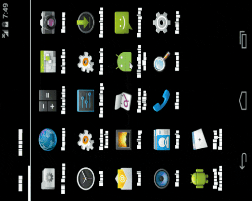

# CustomTabletUI
Custom tablet UI animation for landscape orientation. 



## Usage

Usage is pretty simple and straight forward. You need to add it programmatically. Set the orientation of your activity to landscape in the manifest file. You can access the childviews sequentially as shown below...
Ex: 
  ```
        //Create an object of CircleHorizontalContainer. This requires 3 params. 1> Context 2> Number of childviews to be           //created to the right. 3> Callback
        CircleHorizontalContainer circleHorizontalContainer = new CircleHorizontalContainer(CustomTabletUIActivity.this, 2,         CustomTabletUIActivity.this);
        rootView.addView(circleHorizontalContainer);// You can add it to your parent view as per requirement.

        //ChildViews can be accessed and intialized as below
        ChildCircleContainer childCircleContainer1 = circleHorizontalContainer.getChildAtPosition(1);
        childCircleContainer1.setText("Activity 1");
        ChildCircleContainer childCircleContainer2 = circleHorizontalContainer.getChildAtPosition(2);
        childCircleContainer2.setText("Activity 2");
  ```
##Helper Methods
 For circles on the right you can use the following:
 ```
 ChildCircleContainer childCircleContainer = circleHorizontalContainer.getChildAtPosition(1);
 childCircleContainer.setText("Activity 1");  // to change text
 childCircleContainer.setTextColor("ffffff"); // to change text color
 childCircleContainer.setOuterRingColor("ffffff"); //to change the outer ring color of the child circle view
 childCircleContainer.setInnerRingColor("ffffff"); //to change the inner ring color of the child circle view
 childCircleContainer.setTextSize(12); // to change the text size
 ```
 To change the AppName text you can do:
 ```
  LeftCircleContainer leftCircleContainer = circleHorizontalContainer.getAppNameView();
  leftCircleContainer.setText("learnNcode");
  ```
 
 This UI looks awesome on a tablet you can customize and edit the way you want. Feel free to use it.
 This is just some experimentation with the canvas. We haven't used any images, so basically fidgeting with circles on      canvas. 
 
 If you like it don't forget to star it. Appreciation and comments are always welcome.
 
 Happy coding happy learning :):):)
